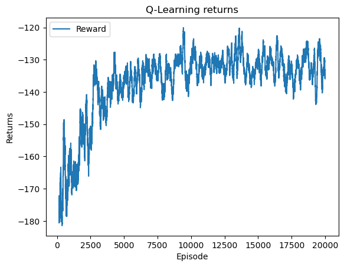
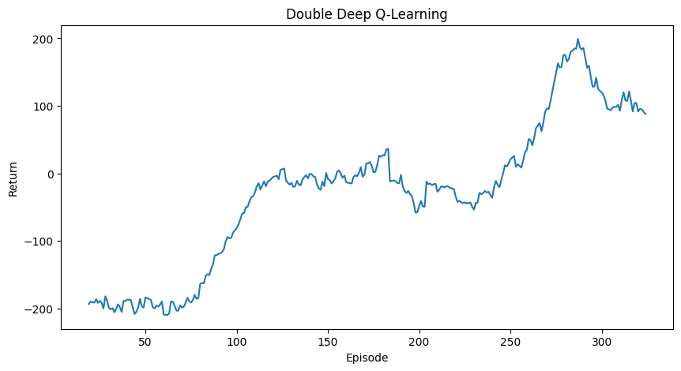
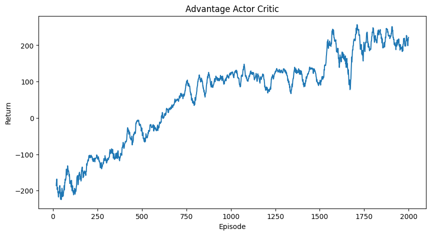
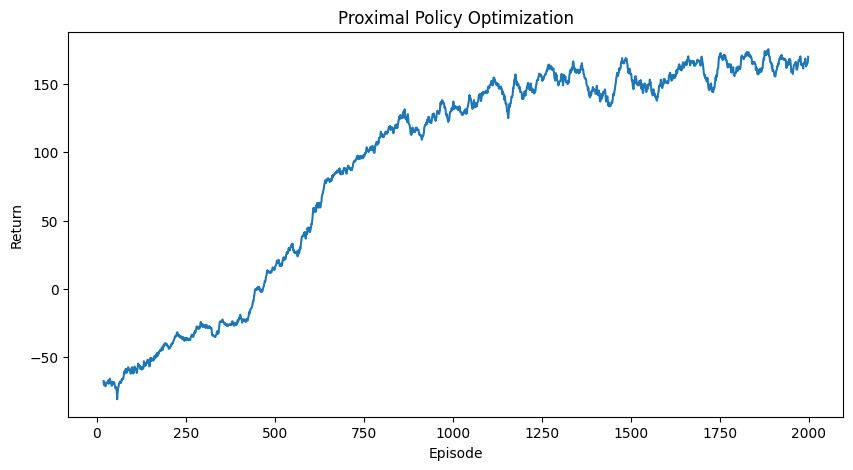
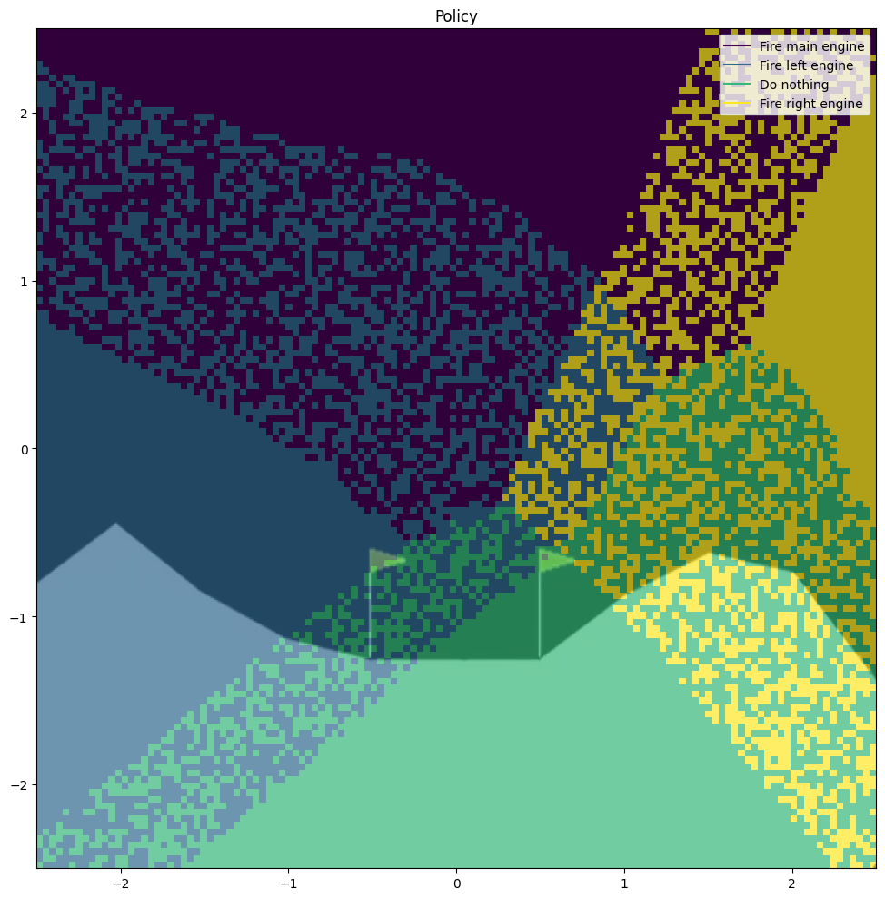
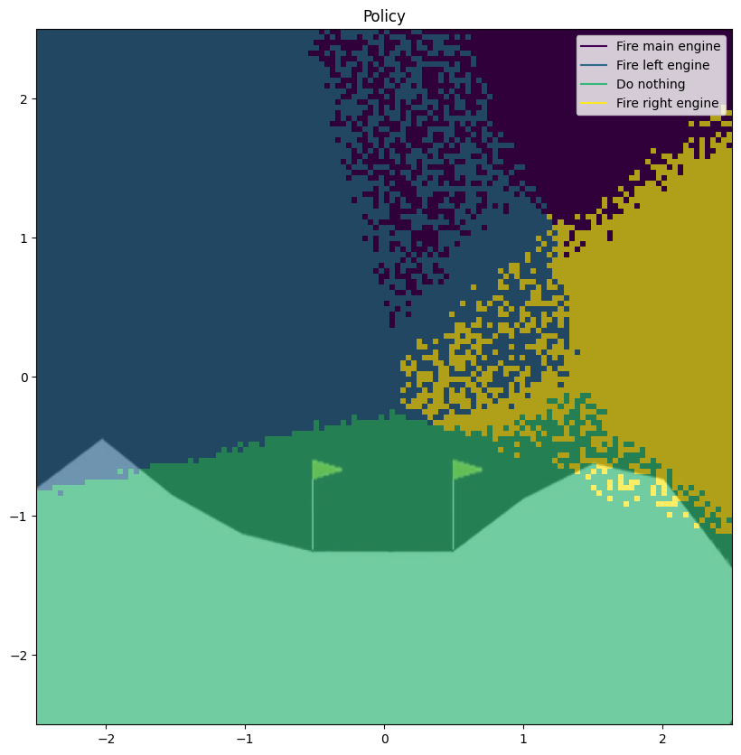

# ReinforcementLearningProject

Our project consists of a case study of the Lunar Lander environment from the OpenAI Gym.
We will implement a series of algorithms to solve the environment and compare their performance.
## The Environment

The Lunar Lander environment is a 2D environment where the agent has to land a spaceship on a landing pad.
The agent has 4 actions available:
- Do nothing
- Fire left orientation engine
- Fire main engine
- Fire right orientation engine

The agent receives a reward of 100 for landing on the landing pad and -100 for crashing. The agent also receives a reward proportional to the fuel used to land the spaceship.

The state space is a 8-dimensional vector with the following components:
- x position
- y position
- x velocity
- y velocity
- angle
- angular velocity
- left leg contact
- right leg contact

The environment is considered solved when the agent reaches an average reward of 200 over 100 episodes.

## Q Learning
Q learning is an off-policy algorithm that learns the optimal action-value function by iteratively updating the Q values using the Bellman equation.
Two different policies are used: the target policy, which is the policy that the agent is trying to learn, and the behavior policy, which is the policy that the agent uses to  select actions.

### Discretization
To use the first two algorithms we need to discretize the state space. We will use a simple discretization method that divides the state space into a grid of cells.
For this algorithm we tried using different granularity of the discretization to see how it affected perfomances, we used 5, 10, 15 and 20 cells for each dimension.
The best results were obtained with 15 cells for each dimension, so we kept it for the following algorithms.

## Q lambda
Q lambda is an extension of Q learning that uses eligibility traces to update the Q values. The eligibility trace is a vector that keeps track of the contribution of each state-action pair to the Q value estimate. We can also add a trace decay parameter lambda to give less credit to states that are further in the past.

## Double Deep Q Learning
As we can see, the approximation of the state space with a grid of cells does not yield good results on this continuous state space. To solve this problem we could use a function approximator that can better capture the continuous nature of the state space: a neural network.

## Actor Critic
In actor to critic aglorithms we have teo networks: the actor and the critic. The actor approximates the policy and decides which action to take, while the critic estimates the value function to evaluate the actor's decisions. The actor is updated using the policy gradient theorem, while the critic is updated using the temporal difference error.

## PPO
Proximal Policy Optimization (PPO) is a policy gradient algorithm that directly optimizes a policy represented by a neural network. It stabilizes training by using a clipped surrogate objective, which prevents large and potentially harmful policy updates 

## Actor to Critic Policy vs PPO Policy

## References
- [Sutton, R. S., & Barto, A. G. (2018). *Reinforcement Learning: An Introduction* (2nd ed.). MIT Press.](http://incompleteideas.net/book/RLbook2020.pdf)
- [Vapnik, V. N. (1995). *The Nature of Statistical Learning Theory*. Springer.](https://statisticalsupportandresearch.wordpress.com/wp-content/uploads/2017/05/vladimir-vapnik-the-nature-of-statistical-learning-springer-2010.pdf)
- [Mnih, V., Kavukcuoglu, K., Silver, D., Graves, A., Antonoglou, I., Wierstra, D., \& Riedmiller, M. (2013). Playing Atari with Deep Reinforcement Learning.](references/DQN.pdf)
- [Benhamou, E. (2019). Variance Reduction in Actor Critic Methods (ACM).](references/VarianceReductionActorCritic.pdf)
- [Schulman, J., Wolski, F., Dhariwal, P., Radford, A., & Klimov, O. (2017). Proximal Policy Optimization Algorithms.](references/PPO.pdf)
- [Open AI Gym documentation for lunar lander environment](https://www.gymlibrary.dev/environments/box2d/lunar_lander/)

## Authors
- [Nicola Cortinovis](https://github.com/NicolaCortinovis)
- [Marta Lucas](https://github.com/15Max)
- [Gabriele Pintus](https://github.com/GabrielePintus)

Checkout our [presentation](presentation.pdf) for an overview of the project. #TODO: ADD correct link